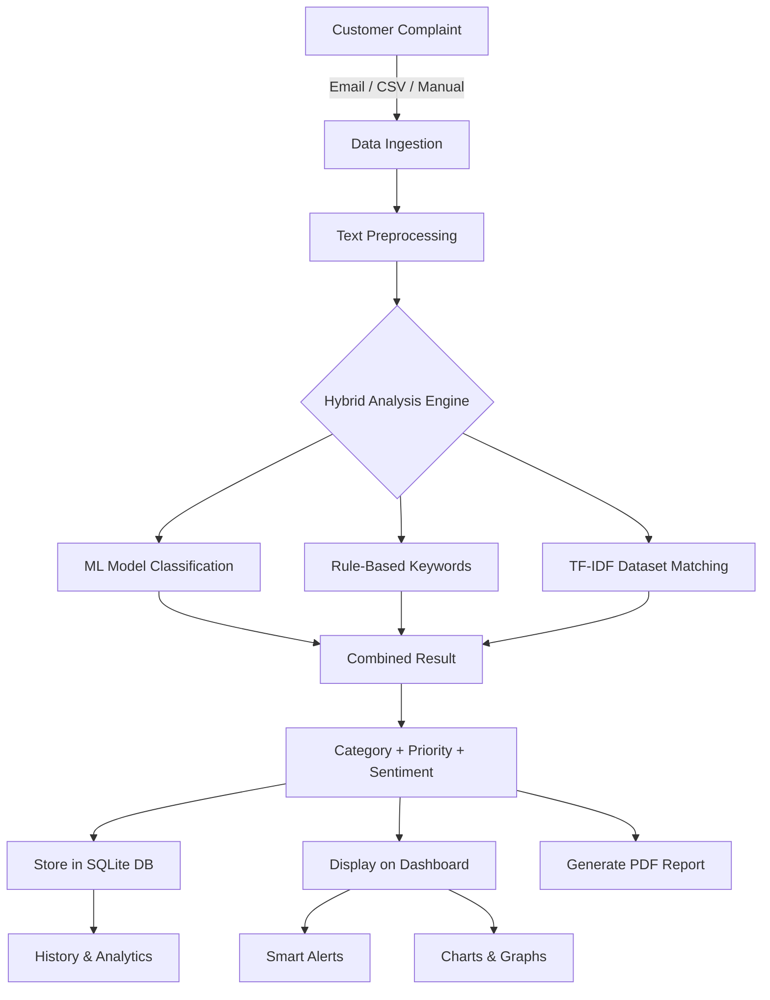

<p align="center">
  
</p>

<h1 align="center">Fixera — AI-Powered Complaint Management System</h1>

<p align="center">
  <strong>Automate. Analyze. Resolve.</strong><br>
  An intelligent complaint management platform that uses Machine Learning and NLP to classify, prioritize, and generate actionable insights from customer complaints.
</p>

<p align="center">
  
  
  
  
  
  
</p>

---

## 📌 Problem Statement

In today's fast-paced business environment, companies receive **thousands of customer complaints daily** through various channels — emails, support tickets, feedback forms, and more. The challenges include:

- **Manual processing** of complaints is slow, expensive, and error-prone
- **Delayed responses** to high-priority issues damage customer trust and brand reputation
- **No visibility** into complaint trends, category spikes, or sentiment shifts
- **Repeat complaints** for the same order go undetected, leading to escalated frustration
- **No standardized reporting** — managers lack actionable data to drive decisions

> **Businesses lose an average of $62 billion annually due to poor customer service.** — *Accenture*

---

## 💡 Our Solution

**Fixera** is an end-to-end AI-powered complaint management system that:

| Feature | Description |
|---------|-------------|
| 🤖 **Auto-Classification** | ML model categorizes complaints into Product, Delivery, Packaging, Trade, and Other |
| 🎯 **Smart Priority** | Assigns High/Medium/Low priority based on urgency, keywords, and sentiment |
| 📊 **Sentiment Analysis** | Detects Positive, Negative, or Neutral customer sentiment |
| 📧 **Email Integration** | Auto-fetches complaints from Gmail inbox via IMAP |
| 📄 **PDF Report Generation** | Creates professional PDF reports with full analysis |
| ⚡ **Smart Alerts** | Real-time dashboard alerts for priority spikes, category trends, and repeated orders |
| 🔁 **Repeat Detection** | Auto-escalates repeat complaints for the same order to High priority |
| 📈 **Visual Dashboard** | Interactive charts and analytics for real-time monitoring |

---

## 🏗️ System Architecture

```
┌─────────────────────────────────────────────────────────────────┐
│                         FIXERA SYSTEM                           │
├─────────────────────────────────────────────────────────────────┤
│                                                                 │
│   ┌──────────────┐    ┌──────────────┐    ┌──────────────┐     │
│   │   Gmail       │    │   CSV File   │    │   Manual     │     │
│   │   Inbox       │    │   Upload     │    │   Input      │     │
│   └──────┬───────┘    └──────┬───────┘    └──────┬───────┘     │
│          │                   │                    │              │
│          └───────────┬───────┘────────────────────┘              │
│                      ▼                                          │
│          ┌───────────────────────┐                               │
│          │    Flask Backend      │                               │
│          │    (REST API)         │                               │
│          └───────────┬──────────┘                               │
│                      │                                          │
│     ┌────────────────┼────────────────┐                         │
│     ▼                ▼                ▼                         │
│  ┌──────┐    ┌──────────────┐   ┌──────────┐                   │
│  │ ML   │    │   Rule-Based │   │ TF-IDF   │                   │
│  │Model │    │   Engine     │   │ Matching  │                   │
│  │(PKL) │    │              │   │          │                    │
│  └──┬───┘    └──────┬───────┘   └────┬─────┘                   │
│     └───────────────┼────────────────┘                          │
│                     ▼                                           │
│          ┌──────────────────┐                                   │
│          │   Hybrid Result  │                                   │
│          │   Category +     │                                   │
│          │   Priority +     │                                   │
│          │   Sentiment +    │                                   │
│          │   Action Plan    │                                   │
│          └────────┬─────────┘                                   │
│                   │                                             │
│      ┌────────────┼────────────┐                                │
│      ▼            ▼            ▼                                │
│  ┌────────┐  ┌─────────┐  ┌─────────┐                          │
│  │SQLite  │  │  PDF     │  │Dashboard│                          │
│  │Database│  │  Report  │  │  UI     │                          │
│  └────────┘  └─────────┘  └─────────┘                          │
│                                                                 │
└─────────────────────────────────────────────────────────────────┘
```

---

## 🔄 Workflow



---

## 🛠️ Tech Stack

### Backend
| Technology | Purpose |
|-----------|---------|
|  | Core programming language |
|  | Web framework & REST API |
|  | Machine Learning model |
|  | Data processing & CSV handling |
|  | Numerical computations |
|  | Lightweight database |
|  | PDF report generation |
|  | Production WSGI server |

### Frontend
| Technology | Purpose |
|-----------|---------|
|  | Page structure |
|  | Styling & responsive design |
|  | Frontend logic & interactivity |
|  | Interactive data visualizations |

### Deployment
| Technology | Purpose |
|-----------|---------|
|  | Cloud hosting platform |
|  | Version control & CI/CD |

---

## ✨ Key Features

### 1. 📊 Interactive Dashboard
- Real-time stat cards (Total, High, Medium, Low)
- Category distribution doughnut chart
- Priority breakdown chart
- Recent activity feed
- **Smart Alerts** — live notifications for anomalies

### 2. 🔍 Complaint Analyzer
- Manual complaint entry with Customer Name & Order ID
- AI-powered classification (category, priority, sentiment)
- Confidence score with visual progress bar
- Recommended action for each complaint
- Dataset matching with similar past complaints

### 3. 📋 Complaint History
- Full searchable table of all analyzed complaints
- Customer name, Order ID, category, priority, sentiment, timeline
- Report summaries integrated into history view

### 4. 📈 Insights & Analytics
- Customer sentiment overview (pie chart)
- Complaint growth trend (line chart)
- Critical vs Normal case breakdown
- Data-driven text insights with percentages
- Detection summary (risk, matches, escalations)

### 5. 📄 PDF Report Generator
- Upload CSV or fetch emails directly
- Professional multi-page PDF with:
  - Executive summary with priority breakdown
  - Detailed complaint table with all fields
  - Customer name & Order ID per complaint
- Repeated Order IDs auto-escalated to High priority
- Reports sorted by frequency and priority

### 6. 📧 Email Integration
- Direct Gmail IMAP integration
- Auto-extracts complaints from inbox
- Extracts Order IDs and Customer Names from email body
- One-click "Use Email Data" for report generation

### 7. 🚨 Smart Alert System
- **High Priority Spike** — alerts when >30% complaints are high priority
- **Category Spike** — detects >40% concentration in any category
- **Repeat Order Detection** — flags order IDs with 3+ complaints
- **Negative Sentiment Alert** — warns when >60% sentiment is negative
- Max 3 alerts shown, "All systems normal" when no triggers

---

## 🧠 ML Pipeline

```
Raw Text
   │
   ▼
┌─────────────────┐
│  Preprocessing   │  → Lowercase, remove special chars
└────────┬────────┘
         ▼
┌─────────────────┐
│  TF-IDF          │  → Text vectorization (trained on 5000+ complaints)
│  Vectorizer      │
└────────┬────────┘
         ▼
┌─────────────────┐
│  ML Classifier   │  → Trained scikit-learn model
│  (model.pkl)     │
└────────┬────────┘
         ▼
┌─────────────────┐
│  Rule Engine     │  → Keyword-based priority & sentiment override
└────────┬────────┘
         ▼
┌─────────────────┐
│  TF-IDF Match    │  → Cosine similarity with dataset for confidence
└────────┬────────┘
         ▼
   Final Result:
   Category | Priority | Sentiment | Confidence | Action
```

---

## 📁 Project Structure

```
Fixera/
├── fixera-backend/
│   ├── app.py                 # Main Flask application (API + logic)
│   ├── train_model.py         # ML model training script
│   ├── fetch_emails.py        # Gmail IMAP email fetcher
│   ├── model.pkl              # Trained ML model
│   ├── ml_vectorizer.pkl      # TF-IDF vectorizer
│   ├── complaints.db          # SQLite database
│   ├── complaints.csv         # Email-fetched complaints
│   ├── requirements.txt       # Python dependencies
│   └── reports/               # Generated PDF reports
│
├── fixera-frontend/
│   ├── index.html             # Single-page application
│   ├── app.js                 # Frontend logic & charts
│   ├── style.css              # Complete styling
│   └── logo.png               # Fixera logo
│
├── SelfData.csv               # Training dataset (5000+ complaints)
├── render.yaml                # Render deployment config
├── .gitignore                 # Git ignore rules
└── README.md                  # This file
```

---

## 🚀 Getting Started

### Prerequisites
- Python 3.9+
- pip (Python package manager)
- Git

### Local Setup

```bash
# 1. Clone the repository
git clone https://github.com/MeghPatel0106/Fixera.git
cd Fixera

# 2. Create virtual environment
python3 -m venv fixera-backend/venv
source fixera-backend/venv/bin/activate

# 3. Install dependencies
pip install -r fixera-backend/requirements.txt

# 4. Set environment variables (for email feature)
export EMAIL="fixera.system@gmail.com"
export PASSWORD="your-app-password"

# 5. Run the server
python3 fixera-backend/app.py

# 6. Open in browser
# http://127.0.0.1:5001
```

### Train the ML Model (Optional)

```bash
python3 fixera-backend/train_model.py
```

---

## 🌐 Deployment

Deployed on **Render** — [Live Demo](https://fixera.onrender.com)

| Config | Value |
|--------|-------|
| Platform | Render |
| Root Directory | `fixera-backend` |
| Build Command | `pip install -r requirements.txt` |
| Start Command | `gunicorn app:app --bind 0.0.0.0:$PORT --workers 2 --timeout 120` |

---

## 📸 Screenshots

| Dashboard | Analyze |
|-----------|---------|
| Real-time stats, charts & smart alerts | AI-powered complaint classification |

| Report Generator | Insights |
|-----------------|----------|
| CSV upload + email fetch → PDF report | Sentiment, trends & risk analysis |

---

## 🔮 Future Scope

| Feature | Description |
|---------|-------------|
| 🔐 **Admin Authentication** | Login/logout system with role-based access |
| 🌍 **Multi-language Support** | Analyze complaints in Hindi, Gujarati, and other languages |
| 📱 **Mobile App** | React Native or Flutter mobile companion app |
| 🔔 **Push Notifications** | Real-time alerts via email/SMS for critical complaints |
| 🗄️ **PostgreSQL Migration** | Replace SQLite with PostgreSQL for production scalability |
| 📊 **Advanced Analytics** | Predictive analytics, trend forecasting, and anomaly detection |
| 🤝 **CRM Integration** | Connect with Salesforce, Zendesk, or Freshdesk |
| 🧠 **Deep Learning** | Upgrade to BERT/Transformer models for better accuracy |
| 📧 **Multi-Channel Intake** | Support Twitter, WhatsApp, and live chat complaints |
| 📋 **SLA Tracking** | Monitor resolution times against service-level agreements |
| 🏷️ **Auto-Tagging** | Automatically tag complaints with subtopics |
| 📤 **Export Options** | Export reports to Excel, Word, and email delivery |

---

## 👥 Team

| Role | Name |
|------|------|
| Developer | **Megh Patel** |

---

## 📄 License

This project is developed for educational and demonstration purposes.

---